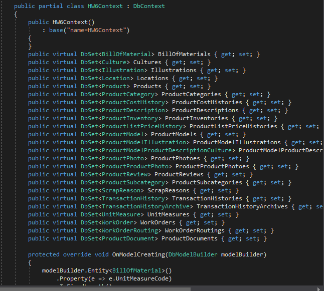
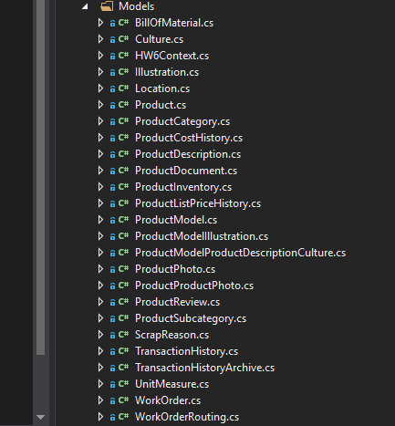
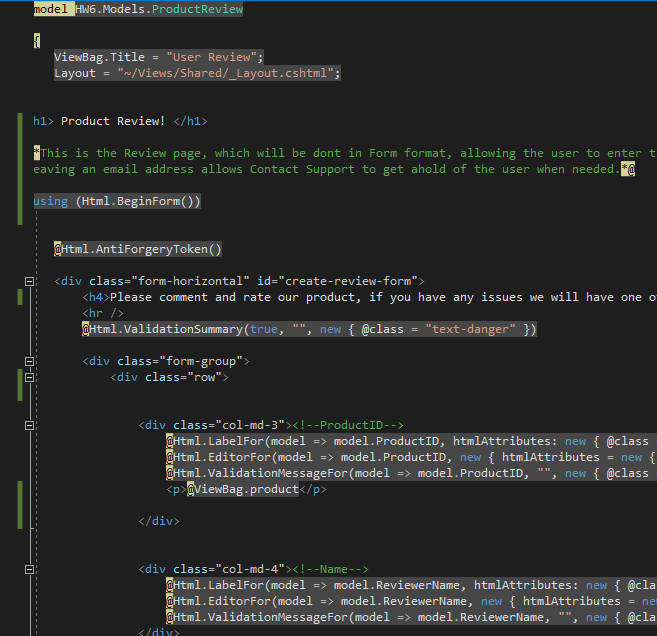
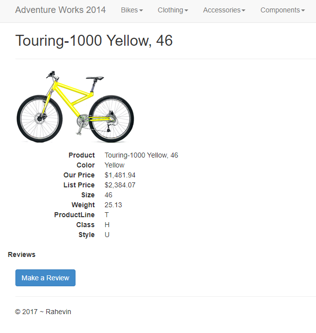
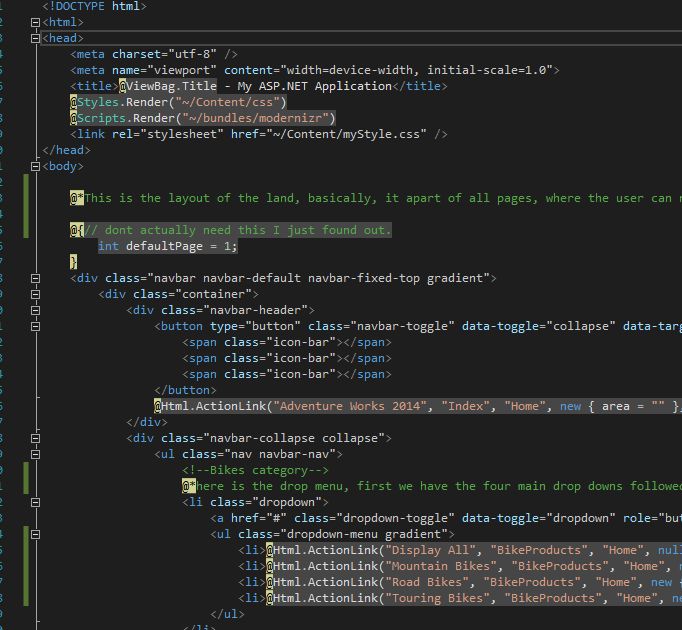
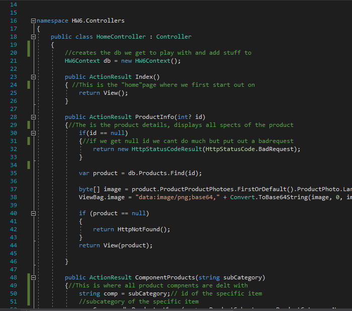
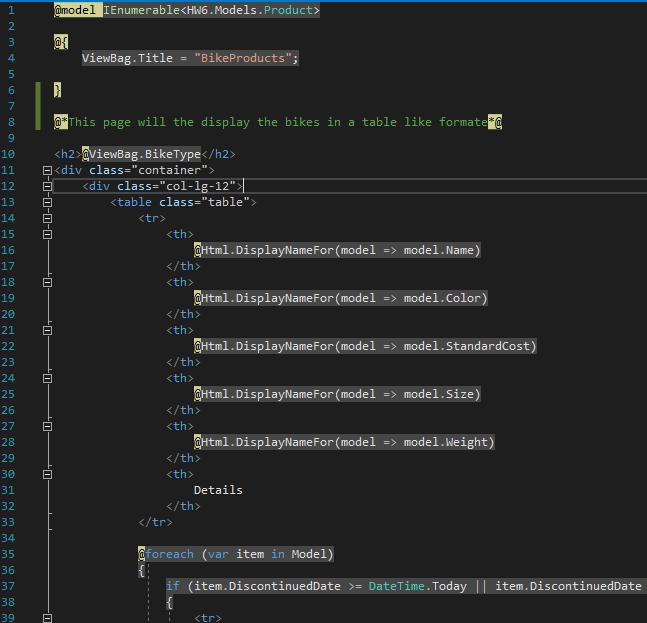
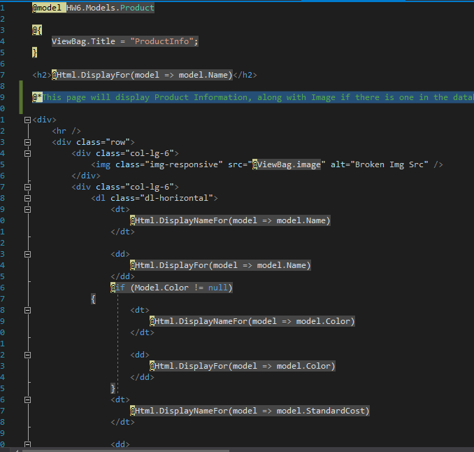
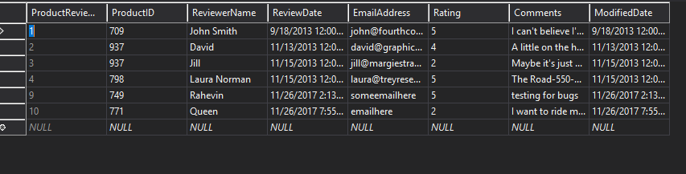

# Rahevin's HW6 Blog

1) Use the a prexisting database.

In this assignment I used AdventureWorks_2014 as the prexisting database.
I imported the package through two different sql statements, like the followings

```
RESTORE DATABASE AdventureWorks2014  
FROM DISK = 'C:\Users\Rahevin\Documents\CurrentClasses\CS 460\rahevinslade.github.io\HW6\AdventureWorks2014.bak'  
WITH MOVE 'AdventureWorks2014_Data' TO 'C:\Users\Rahevin\Documents\CurrentClasses\CS 460\rahevinslade.github.io\HW6\AdventureWorks2014_Data.mdf',  
MOVE 'AdventureWorks2014_Log' TO 'C:\Users\Rahevin\Documents\CurrentClasses\CS 460\rahevinslade.github.io\HW6\AdventureWorks2014_Log.ldf' 

```

2) Create an empty MVC, add the database, reverse engineer model classes. 

inside look of the Context Model page

a Look at all models used for this assignment.


3) Feature 1: Browse Products, user should be about to organize by top level category, then by sub-category. 

The home screen has four tabs, (bikes clothing, Accessories, and Components) each with a list of subcategories. Allowing the user to navigate through the database and view items.

4) Feature 2: Add Review, insert to the database, allow a user to enter name, email address, rating and a lengthy comment/review, once inserted to the database "thank" the user. You can implement a browse function so the user knows what product they are reviewing. 

I have added a review page, where the user may place a review on an item that they have purchased or are looking at. It saves the product id with the review, there for we can track which item has been reviewed, It includes the users name, email, rating and comments about the bike. 



This last bit below Thanks the user for their review, then proceeds to take them back to the product and we can view the newest review placed on the product

```
            <div class="row">
                <div class="col-md-4">
                    <input type="submit" value="Submit Review" class="btn btn-default" onclick="Thanks()" />
                </div>
            </div>
        </div>
    </div>
}

<script>
    function Thanks() {
        alert("Thank you!")
    }
</script>
```

Example of image for product, although not all images are included in the database, from my understanding it's mostly bike images



Below are more code demonstations

This is the layout used for the "menu" bar 
!

This the Homecontroller which determines how each page is run and how it works, for the most part, the product pages run the same, while the review and product information is slightly different


Here is and example of one of the product pages
Bikes


Here is how the Productinfomation is created for each item


A look at the database after a Review has been made


Heres a Video Demonstration!

<video controls="controls">
  <source type="video/mp4" src="Demo.mp4"></source>
  <source type="video/webm" src="Demo.webm"></source>
  <p>Your browser does not support the video element.</p>
</video>