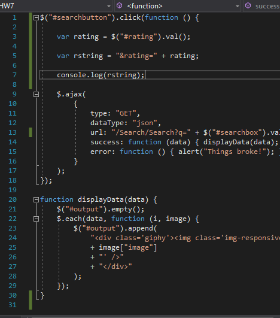
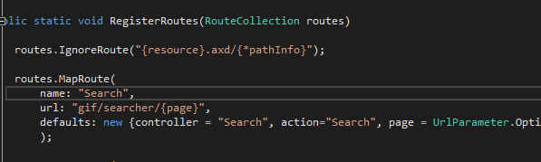
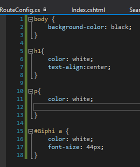
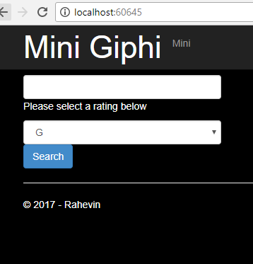
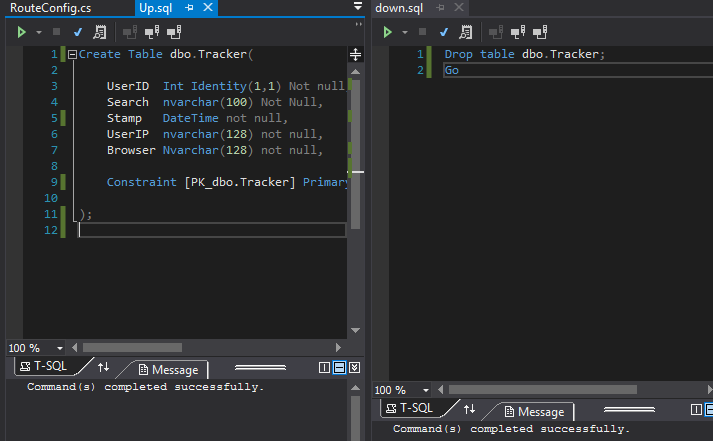
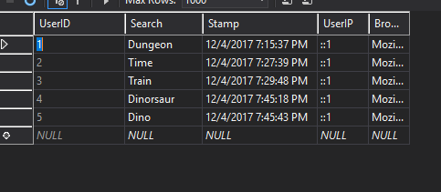
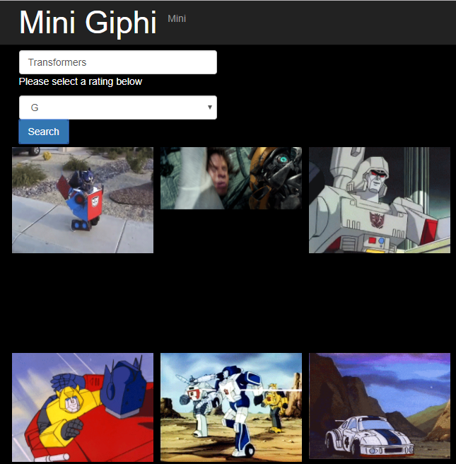

# Rahevin's HW7 Blog

1) Single Page Javascript

Written a single page javascript, first function is deployed when the submit button is pressed, it grabs the search string, and option choice and puts them into a URL. Inside of ajax which then calls displayData which explains itself and displays the image.

2) Uses custom routing rule in RoutConfig.cs, that makes sense and routs to a new Controller that isn't Home

Created a custom router, it appears to be working. creates a url pathway for the search to display the correct images placed in the textbar.

3) Page looks nice, creates a custom CSS.

Created a custom CSS page called Pretty, it creates a black background, changes text and headers to white, and displays a larger title text.

Here is a screenshot of the page that is displayed upon loading the app.

4) Has database for Logging, uses script to create this database

This picture below displays both my Up and Down script for creating the table for the Database.

Here are some tested entries for the searches.

5) Searches Giphy and shows results in a grid pattern

Its more of a row pattern with spaces some of the gifs are different sizes, but I did make a max size so that dont become too large, I feel like if I stretched the smaller ones they would then become warped.

6) Additional client side options, and serve side processing

From the image above you can see there is an option to choose different ratings, there are three to choose from. G, PG, and R. I don't know why anyone would choose R but I left it an option.

<video width="1000" height="666" controls="controls">
  <source src="Demo.mp4" type="video/mp4" />
</video>

Find my repo in my GitHub [here](https://github.com/RahevinSlade/rahevinslade.github.io/tree/master/HW7/HW7/HW7)