# Rahevin's HW8 Blog

1) Has scripts to create, populate and delete the database

Created an Up and Down Sql script along with the .mdf file to store everything in. Also created a ER Diagram on paper before creating and UP script.

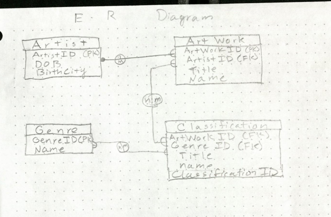

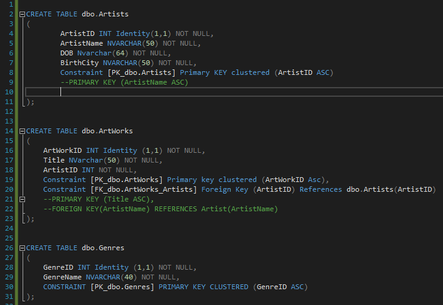

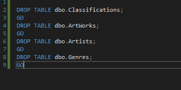

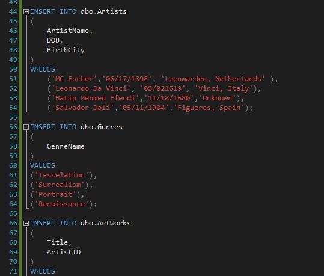

2) Tables have appropriate names, genres,relations/constraints and classifications. 
Artists has an ID that is a foriegn key to Artworks, and Artworks has a foriegn key in Classification, and Genres has a foriegn key in Classifications. 

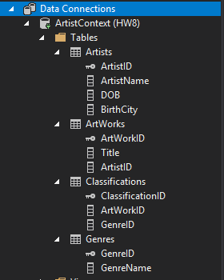

3) Main page has menu, with lists pages showing all entities

Menu page displays links to the next pages which will display all entites within the following table and details.

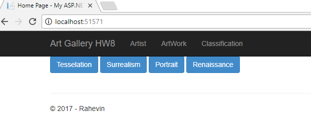


4) Has a working CRUD functionality for artists.

I used auto gen code and then edited to work for my written code. To view more watch the Demo video after step 6.

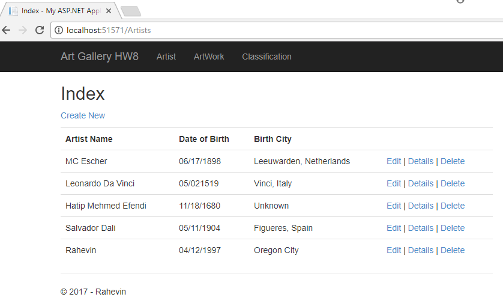

5) Has a genres buttons, shows works and artists, sorted correctly

This is what uses Ajax for the menu buttons, inside the Home View Index. 
```
    @foreach (var item in Model.ToList())
    {
        <button class="btn btn-primary" onclick="Ajax('@item.GenreID');">@item.GenreName</button>
    }
```


6) Uses AJAX

Ajax is saved inside of scripts and when including in a file we do the following. Saved as gajax.js

```
@section Javascript
{
    <script type="text/javascript" src="@Url.Content("/Scripts/gajax.js")"></script>
}
```

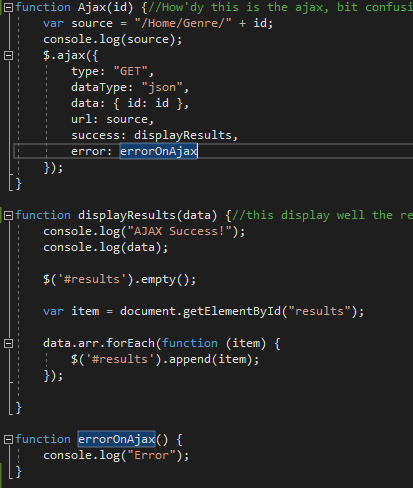

## Demo Video

Find it in my GitHub [here](https://github.com/RahevinSlade/rahevinslade.github.io/tree/master/HW8/HW8/HW8)

Press play below, it will look like nothing is happening for about 5 seconds, then things will begin to happen.

<video width="1000" height="666" controls="controls">
  <source src="Demo.mp4" type="video/mp4" />
</video>

Personal notes for later, small steps to get started and move things quicker next time.

Step 1)

Ensure you have entity frameworks installed (if so proceed to next step).

Once your project opens, click Tools, click NuGet Package Manager, click Manage NuGet Package solution, then Browse and search "entity" select EntityFramework, click your project and install, click ok, I Accept.

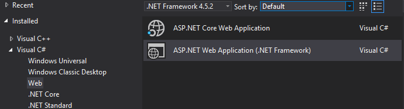

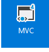

Step 2)
Include your UP and Down script inside the App_Data.
-create as a new file outside of the project then add save it in the App-Data folder, then right click App_data and add existing item.

Include in you App_Data, add, new item, select SQL Server Database add should be a .mdf file.

Then go to Server Explore find your .mdf file and refresh, now you should be able to connect your SQL scripts.

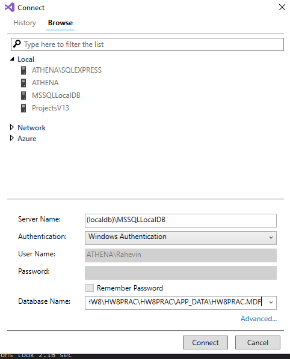

Run UP script

Step 3)

right click Models, add new item, under Visual C#, select Data, the click ADO.NET Entity Data Model. Name it "NameContext". then choose Code First from Database click "next" select your .mdf file, click next, then select your tables and dbo. click finish

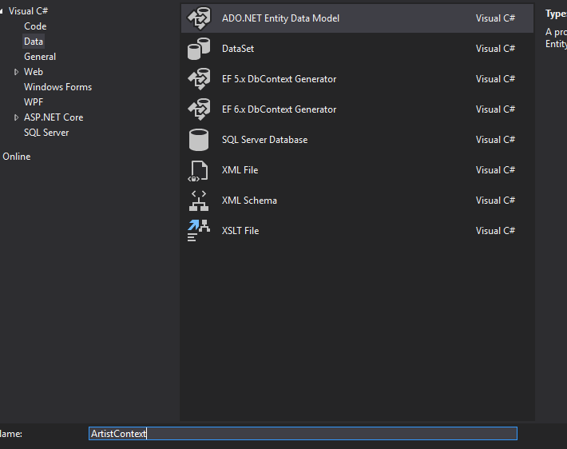

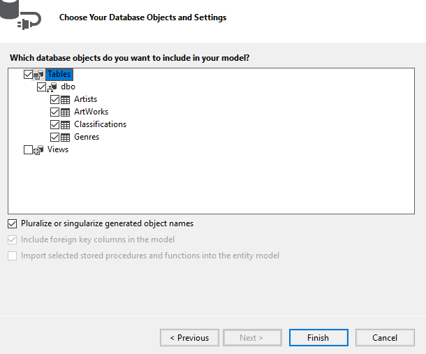

Step 4) 

Adding CRUD for Artist

Be sure to reload the solution, then right click Controllers, add, new scaffolded item, then select MVC 5 Controller with views, using Entity Framework. 

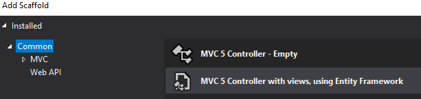

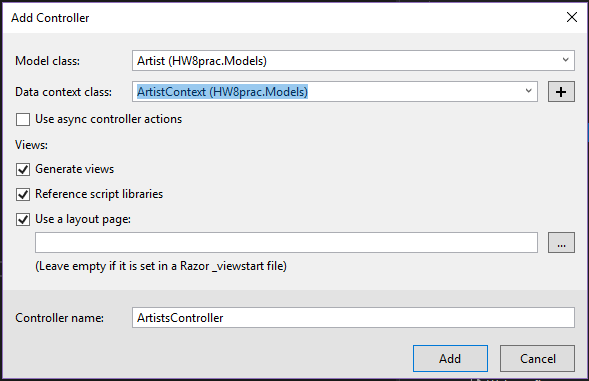

repeat this process for each view or controller you'll need

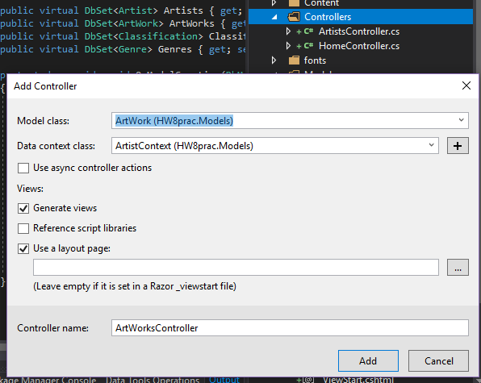

Step 5)

Now you just need to fix your layout page so you can cruise your new tabs.

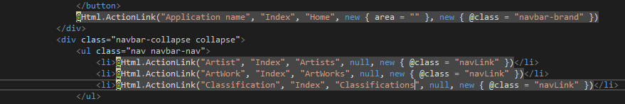

Step 6) 

Now to display ajax and get genres to display on home page using razor.

This is what we will include inside the Views where we use our Ajax.

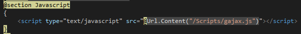

Here is how we will use razor and spit out all the Genres as buttons

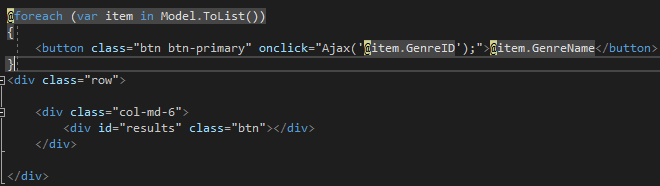

Place the Ajax file "gajax" inside the scripts folders as a .js file.
Click Add, New item, then under Web, select JavaScript File.

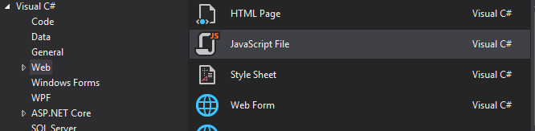


You'll also need to alter the HomeController and include Models such as the followings.

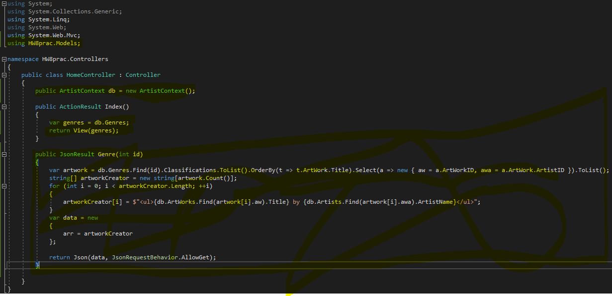

Now this should work.

