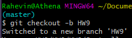
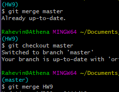
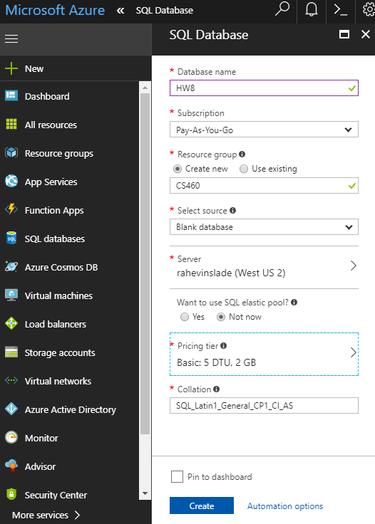
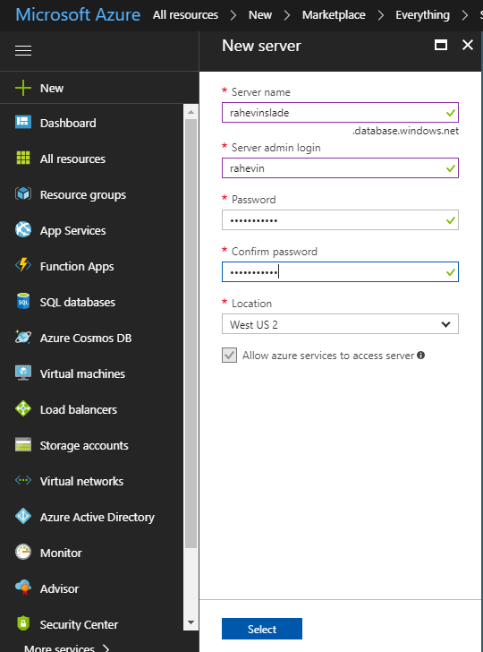
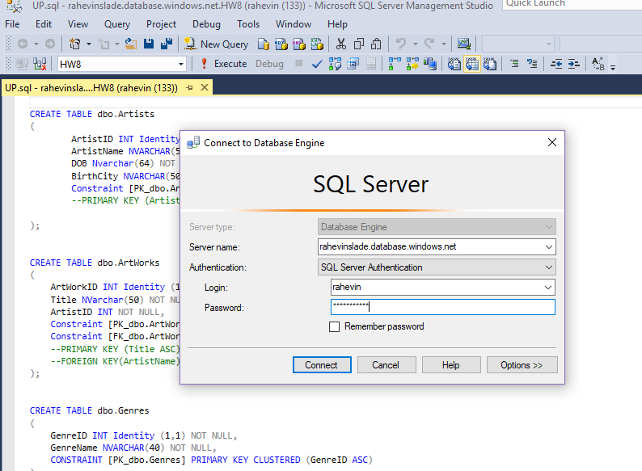
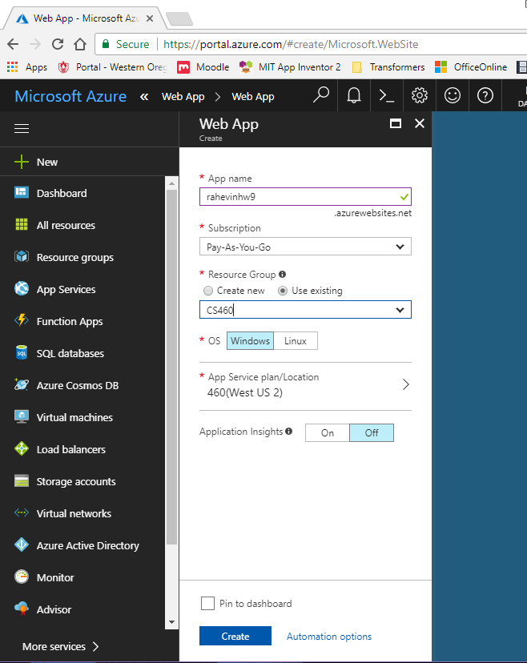
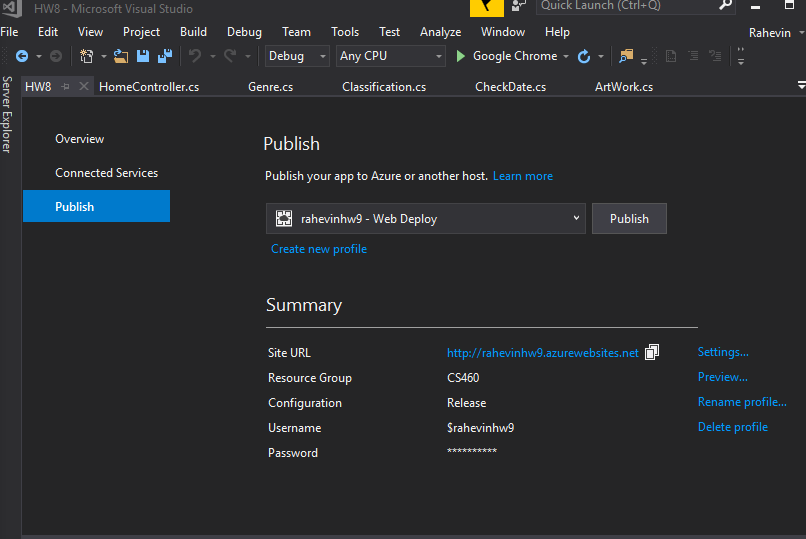
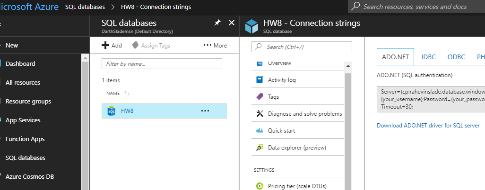
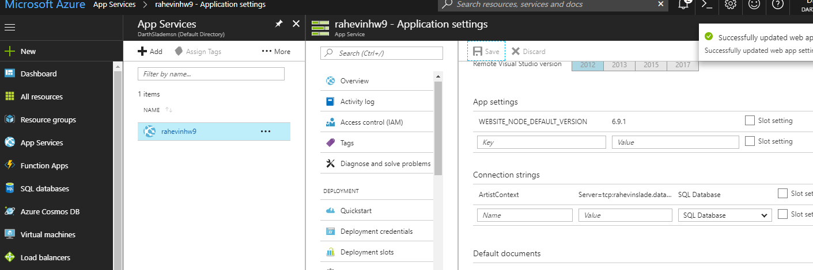

# Rahevin's HW9 Blog

1) Homework 8 has been created on AZure

2) Has URL and works just like HW8

3) uses database on Azure

4) password does not appear anywhere in Git repo

Steps on how to perform HW9 are below.

Create a new branch on git

When your finished merge to master

Step 1

We begin with loging into Azure under a microsoft account.
Click on "SQL databases"
Click on "Add" on the top right and fill in the following information

If there does not exist a server create one

Step 2

Open up your personal MSSQL Management Studio, I used 2016 since it was already installed
Connect to azure database, which can be found in the database server overview.

Then within the MSSQL open up your "UP" file from the project you wish to deploy, within App_Data folder inside the project
Run the UP.sql in the MSSQL.

Step 3

inside Azure Portal click "App Services" then click "Add" and click "Web App" and click "Create". Fill out the information and click "Create"

Step 4

Open up project solution in Visual Studio's, right click project inside of solution explorer and click "Publish" Select "Microsoft Azure App Service" select toggle to "Select Existing" click "Publish". Select Account, Plan, and resource. Select your App Service from selection Menu click "OK". 

Now it will open up a web page thats not going to work, proceed to Step 5.

Step 5

Open up Azure Portal, Click "SQL databases", Click you projects Azure SQL DB, select "Connection Strings" copy this item. Now Click "App Services" select your project, click "Application Settings" wihtin Settings. Slide down to "Connection Strings" Enter in the name of your Context file name from the project you wish to upload in the "Name" field. In the "Value" field paste your connection string AND BE SURE TO BE RID OF THE BRACKETS TOO and replase user name and password with the ones you created earlier in the project. Click "Save" at the top.

Now reload the url or go to Overview and click the link and you should get

Here is the link to the project that has been deployed to Azure

Find it online [here](http://rahevinhw9.azurewebsites.net)

